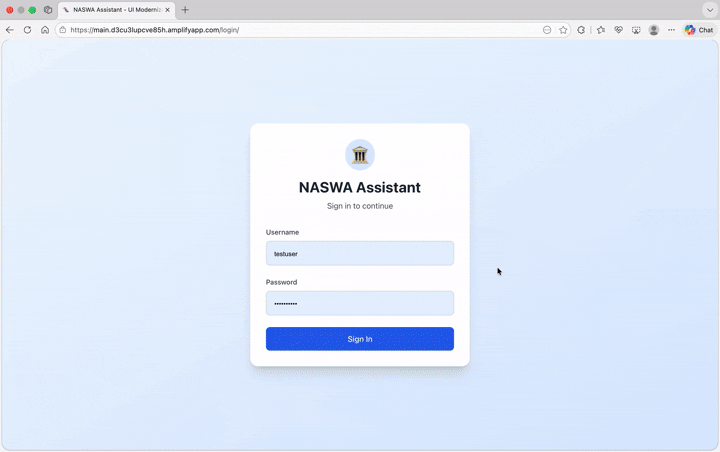
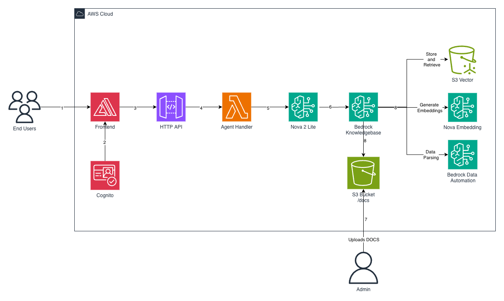

# Multilingual RAG Chatbot

An AI-powered multilingual chatbot platform for the National Association of State Workforce Agencies (NASWA) that provides intelligent document retrieval and conversational assistance, powered by AWS Bedrock Knowledge Base and RAG (Retrieval Augmented Generation).

## Demo

<div align="center">
  
  <p><em>Multilingual RAG Chatbot in action - English and Spanish support with source attribution</em></p>
</div>

## Index

| Description           | Link                                                  |
| --------------------- | ----------------------------------------------------- |
| Overview              | [Overview](#overview)                                 |
| Architecture          | [Architecture](#architecture-diagram)                 |
| Detailed Architecture | [Detailed Architecture](docs/architectureDeepDive.md) |
| Prerequisites         | [Prerequisites](docs/prerequisites.md)                |
| User Flow             | [User Flow](docs/userGuide.md)                        |
| Deployment            | [Deployment](docs/deploymentGuide.md)                 |
| Embed chat widget     | [Chat embed guide](docs/chatEmbedGuide.md)            |
| Credits               | [Credits](#credits)                                   |
| License               | [License](#license)                                   |

## Disclaimers
Customers are responsible for making their own independent assessment of the information in this document.

This document:

(a) is for informational purposes only,

(b) references AWS product offerings and practices, which are subject to change without notice,

(c) does not create any commitments or assurances from AWS and its affiliates, suppliers or licensors. AWS products or services are provided "as is" without warranties, representations, or conditions of any kind, whether express or implied. The responsibilities and liabilities of AWS to its customers are controlled by AWS agreements, and this document is not part of, nor does it modify, any agreement between AWS and its customers, and

(d) is not to be considered a recommendation or viewpoint of AWS.

Additionally, you are solely responsible for testing, security and optimizing all code and assets on GitHub repo, and all such code and assets should be considered:

(a) as-is and without warranties or representations of any kind,

(b) not suitable for production environments, or on production or other critical data, and

(c) to include shortcuts in order to support rapid prototyping such as, but not limited to, relaxed authentication and authorization and a lack of strict adherence to security best practices.

All work produced is open source. More information can be found in the GitHub repo.

## Overview

This application combines AI-powered document processing with intelligent retrieval and multilingual support to deliver comprehensive workforce assistance. Built on a serverless architecture with RAG capabilities, Cognito authentication, and a modern responsive web interface.

### Key Features

- **Multilingual Support** - Full English and Spanish language capabilities for queries and responses
- **RAG-Powered AI System** using AWS Bedrock with Amazon Nova models
- **Intelligent Document Retrieval** via Bedrock Knowledge Base with S3 Vectors
- **Secure Authentication** using Amazon Cognito with JWT authorization
- **Document Source Attribution** with relevance scoring and direct document access
- **Conversation Memory** for context-aware multi-turn conversations
- **Modern Web Interface** with responsive design and real-time chat experience
- **One-Click Deployment** via AWS CDK and CodeBuild automation

### Technology Stack

| Component | Technology |
|-----------|------------|
| **AI/ML** | Amazon Bedrock, Nova 2 Lite, Nova Multimodal Embeddings |
| **Vector Store** | S3 Vectors with Cosine Similarity |
| **Backend** | AWS Lambda (Python 3.12), API Gateway HTTP API |
| **Authentication** | Amazon Cognito User Pools |
| **Frontend** | Next.js 16, React 19, TypeScript, Tailwind CSS |
| **Infrastructure** | AWS CDK, CloudFormation |
| **Hosting** | AWS Amplify |
| **Document Storage** | Amazon S3 |

## Architecture Diagram



The application implements a serverless, event-driven architecture with RAG (Retrieval Augmented Generation) at its core, combining secure authentication with intelligent document retrieval and multilingual AI responses.

For a detailed deep dive into the architecture, including core principles, component interactions, data flow, security, and implementation details, see [docs/architectureDeepDive.md](docs/architectureDeepDive.md).

## User Flow

The chatbot provides an intuitive conversational interface with the following flow:

1. **User Authentication** - Login via Cognito for secure access
2. **Language Selection** - Choose between English or Spanish
3. **Query Submission** - Type a question or select from sample questions
4. **RAG Processing** - System retrieves relevant documents and generates response
5. **Response with Sources** - AI response with document attribution and relevance scores
6. **Document Access** - View or download source documents directly

For a detailed overview of the user journey and application workflow, see [docs/userGuide.md](docs/userGuide.md).

## Deployment

**Region:** **`us-east-1` only.** Read [docs/prerequisites.md](docs/prerequisites.md) for permissions and Bedrock access before you deploy.

### What you are running

`./deploy.sh` uses the **AWS CLI** to set up **CodeBuild**, then starts a build. **CodeBuild** (in AWS) runs the CDK deploy and the frontend build—you do **not** need Node.js or the CDK on your laptop for that path.

### What you need on the machine where you type commands

| Where you run the script | Install |
|--------------------------|---------|
| **[AWS CloudShell](https://docs.aws.amazon.com/cloudshell/latest/userguide/welcome.html)** in the console (**region `us-east-1`**) | Nothing extra — **AWS CLI** and **Git** are already there (**use this if unsure**) |
| Your own computer | **[AWS CLI v2](https://docs.aws.amazon.com/cli/latest/userguide/getting-started-install.html)** (`aws configure`, default region **`us-east-1`**) and **Git** |

Without **AWS CLI** and **Git**, you cannot run the steps below as written.

### Deploy (main path)

1. Open the **AWS Console**, set the region to **`us-east-1`**.
2. Open **CloudShell** (terminal icon) 
3. Confirm the CLI works: `aws sts get-caller-identity` (should print your account).
4. Clone the repo, run the script, and wait until it finishes (do not close the session while it runs):

   ```bash
   git clone https://github.com/ASUCICREPO/multilingual-RAG-chatbot.git
   cd multilingual-RAG-chatbot
   chmod +x ./deploy.sh
   ./deploy.sh
   ```

5. **Success:** the script prints a deployment summary with a **frontend URL** (Amplify). Copy that URL—that is the app.

### After that

Deploy does **not** create login users or load your documents. In order: create a **Cognito** user, upload files to the stack’s S3 **`docs/`** folder, run a **Knowledge base sync** in Bedrock, then open the frontend URL and sign in.

Step-by-step (including stack output commands and troubleshooting): **[docs/deploymentGuide.md](docs/deploymentGuide.md)**.

## Infrastructure

### AWS Services Used

| Service | Purpose |
|---------|---------|
| **Amazon Bedrock** | Foundation model inference (Nova 2 Lite) and embeddings |
| **Bedrock Knowledge Base** | RAG document indexing and retrieval |
| **S3 Vectors** | Vector storage for document embeddings |
| **Amazon S3** | Source document storage |
| **AWS Lambda** | Serverless compute for API handlers |
| **API Gateway** | HTTP API with JWT authorization and CORS |
| **Amazon Cognito** | User authentication and JWT authorization |
| **AWS Amplify** | Frontend hosting and deployment |
| **AWS CDK** | Infrastructure as Code |
| **AWS CodeBuild** | CI/CD pipeline automation |

For a detailed overview of the application infrastructure, see [docs/architectureDeepDive.md](docs/architectureDeepDive.md).

## Documentation

- **[Architecture Deep Dive](docs/architectureDeepDive.md)** - Comprehensive architecture documentation
- **[Prerequisites](docs/prerequisites.md)** - Required tools and AWS permissions
- **[Deployment Guide](docs/deploymentGuide.md)** - Deploy with CodeBuild (`deploy.sh`) and post-deploy steps
- **[User Guide](docs/userGuide.md)** - Frontend usage and features
- **[API Documentation](docs/apiDoc.md)** - Backend API reference
- **[Chat embed guide](docs/chatEmbedGuide.md)** - Use the floating chat UI on another website (React, iframe, or custom client)

## Project Structure

```
multilingual-RAG-chatbot/
├── backend/
│   ├── bin/                    # CDK app entry point
│   ├── lib/                    # CDK stack definitions
│   │   └── bedrock-chatbot-backend-stack.ts
│   ├── lambda/
│   │   └── agent-handler/      # Lambda function code
│   │       └── index.py
│   ├── cdk.json               # CDK configuration
│   └── package.json           # Backend dependencies
├── frontend/
│   ├── app/
│   │   ├── components/        # React components
│   │   │   ├── ChatBot.tsx    # Main chat interface
│   │   │   ├── Header.tsx     # Navigation header
│   │   │   ├── Hero.tsx       # Hero section
│   │   │   └── ContentCards.tsx
│   │   ├── lib/               # Utilities
│   │   │   ├── auth.ts        # Cognito authentication
│   │   │   ├── chatApi.ts     # API client
│   │   │   └── config.ts      # Configuration
│   │   ├── login/             # Login page
│   │   ├── page.tsx           # Main page
│   │   ├── layout.tsx         # Root layout
│   │   └── globals.css        # Global styles
│   ├── next.config.js         # Next.js configuration
│   ├── tailwind.config.js     # Tailwind CSS configuration
│   └── package.json           # Frontend dependencies
├── docs/                      # Documentation (incl. chatEmbedGuide.md)
├── deploy.sh                  # Automated deployment script
├── cleanup.sh                 # Resource cleanup script
├── buildspec.yml              # CodeBuild specification
└── README.md                  # This file
```

## Credits

This application was architected and developed by [Sahajpreet Singh Khasria](https://www.linkedin.com/in/sahajpreet/), [Apoorv Singh](https://www.linkedin.com/in/apoorv16/), and [Lahari Shakthi Arun](https://www.linkedin.com/in/shakthiarun22/) with solutions architect [Arun Arunachalam](https://www.linkedin.com/in/arunarunachalam/), program manager [Tom Orr](https://www.linkedin.com/in/thomas-orr/) and product manager [Rachel Hayden](https://www.linkedin.com/in/rachelhayden/). Thanks to the ASU Cloud Innovation Center Technical for their guidance and support.

## License

See [LICENSE](LICENSE) file for details.

---

**Built with AWS Bedrock and deployed on AWS Amplify**
