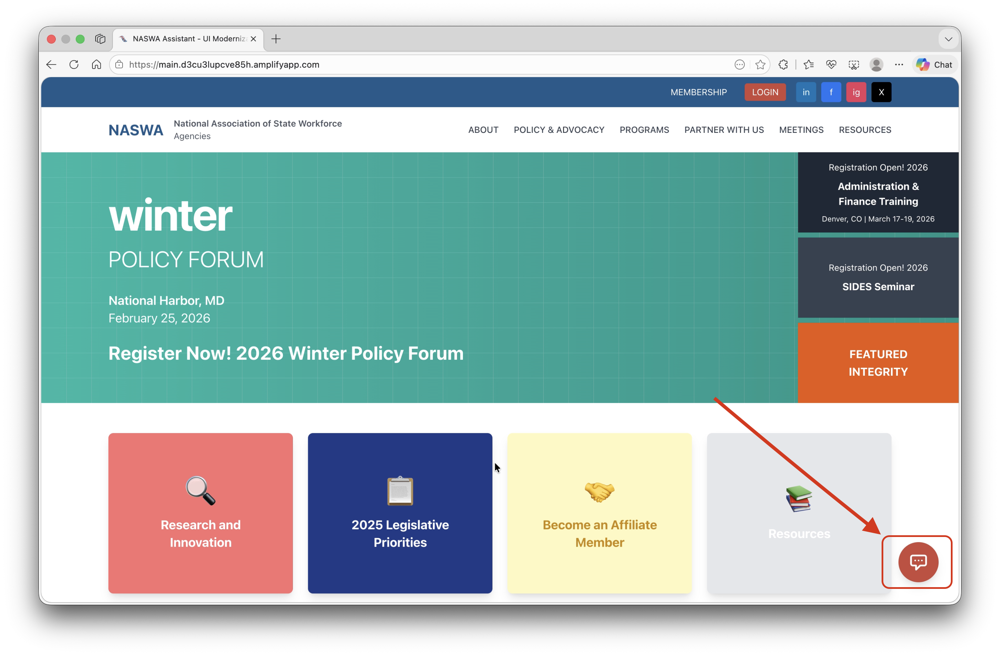
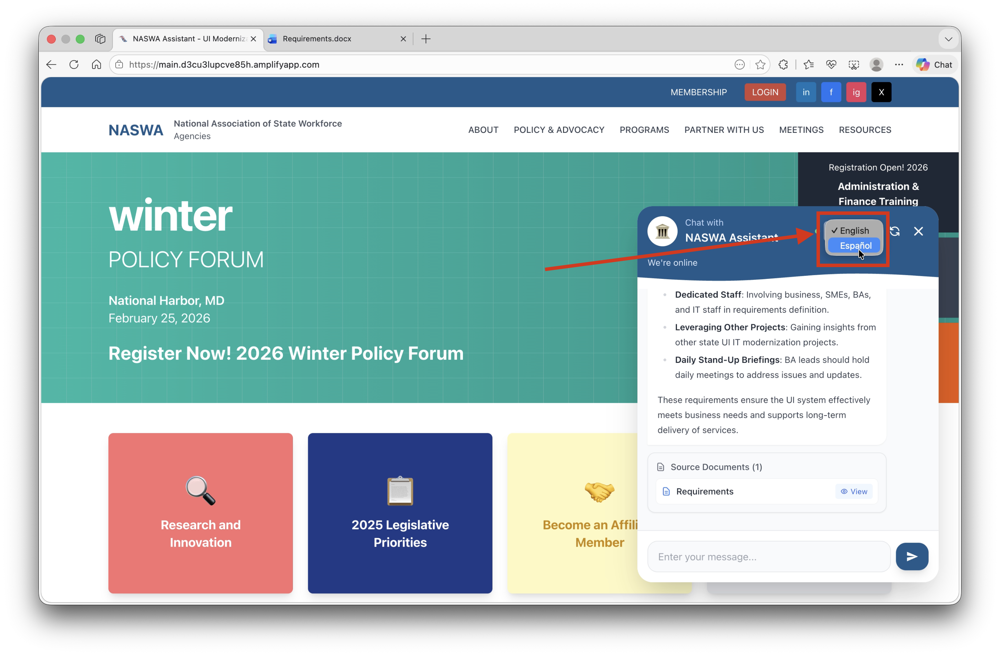
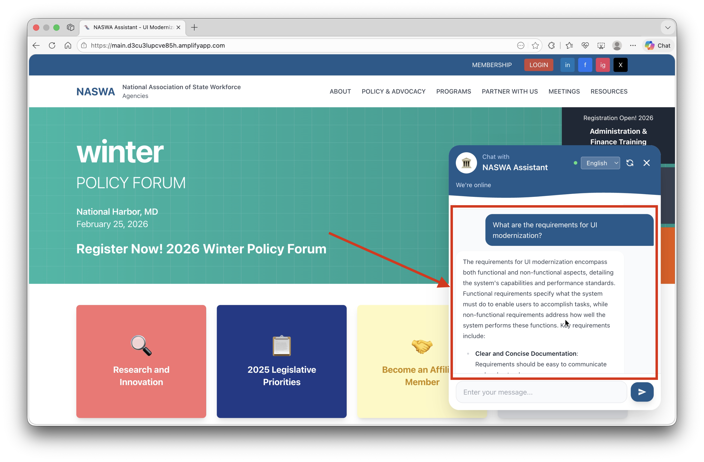
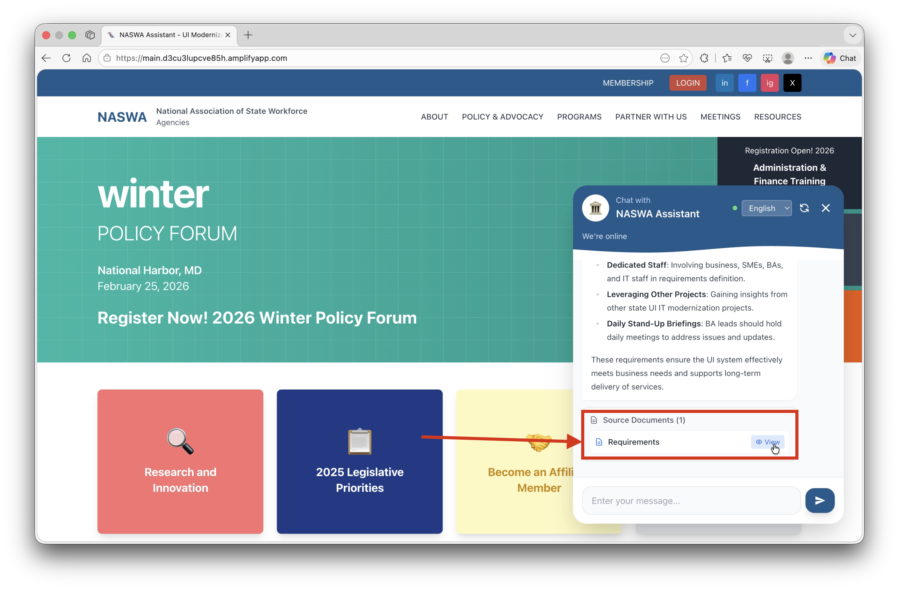

# User Guide

**Please ensure the application is deployed using the instructions in the deployment guide:**
- [Deployment Guide](./deploymentGuide.md)

Once you have deployed the solution, this user guide will help you navigate the available functions and features.

## Overview

The Multilingual RAG Chatbot provides intelligent document retrieval and conversational assistance. The system:

- **Answers Questions**: Provides AI-powered responses based on your uploaded documents
- **Supports Multiple Languages**: Full English and Spanish language support
- **Cites Sources**: Shows which documents were used to generate responses
- **Enables Document Access**: View or download source documents directly from chat

The system uses RAG (Retrieval Augmented Generation) to find relevant information in your documents and provide accurate, source-backed responses.

**Important Disclaimer**: This tool provides AI-generated responses based on uploaded documents. Always verify information with original sources for critical decisions.

## Getting Started

### Accessing the Application

After deployment, you'll receive:
1. **Frontend URL**: The web application (e.g., `https://main.d1234abcd.amplifyapp.com`)
2. **API Gateway URL**: Backend API endpoint (for developers)

Navigate to the Frontend URL to start using the chatbot.

### Logging In

**Test User Credentials** (created during deployment):
- **Username**: `testuser`
- **Password**: The password you configured during deployment

**Login Process**:
1. Navigate to the Frontend URL
2. Enter your username and password
3. Click **Login**
4. You'll be redirected to the main application

## Features

### 1. Chat Interface

The chatbot appears as a floating widget in the bottom-right corner of the screen.



**Opening the Chatbot**:
- Click the red chat bubble icon (💬) in the bottom-right corner
- The chat window will expand with a welcome message

**Chat Window Elements**:
- **Header**: Shows "NASWA Assistant" with connection status
- **Language Selector**: Dropdown to switch between English and Spanish
- **Message Area**: Scrollable conversation history
- **Input Field**: Text box to type your questions
- **Send Button**: Arrow button to submit your message

### 2. Language Selection

The chatbot supports full bilingual operation in English and Spanish.



**Switching Languages**:
1. Click the language dropdown in the chat header
2. Select "English" or "Español"
3. The conversation will reset with a new welcome message
4. All interface text updates to the selected language

**Language Behavior**:
| Feature | English | Spanish |
|---------|---------|---------|
| Welcome Message | "Hello! I'm the NASWA Assistant..." | "¡Hola! Soy el Asistente de NASWA..." |
| Input Placeholder | "Enter your message..." | "Escribe tu mensaje..." |
| Source Labels | "Source Documents" | "Documentos Fuente" |
| View Button | "View" | "Ver" |

### 3. Asking Questions

**Two Ways to Ask Questions**:

**Method 1: Type Your Question**
1. Click in the message input field
2. Type your question
3. Press **Enter** or click the send button (➤)

**Method 2: Use Sample Questions**
1. Click one of the pre-defined sample question buttons
2. The question is automatically sent

**Sample Questions (English)**:
- "What are the requirements for UI modernization?"
- "What are the recommended staffing levels?"
- "What DevOps practices should we follow?"

**Sample Questions (Spanish)**:
- "¿Cuáles son los requisitos para la modernización de UI?"
- "¿Cuáles son los niveles de personal recomendados?"
- "¿Qué prácticas de DevOps debemos seguir?"

### 4. Understanding Responses



**Response Components**:

**AI Response Text**:
- Formatted with markdown (headers, lists, bold text)
- Concise summaries (5-6 sentences for technical questions)
- Natural conversational tone for greetings/thanks

**Source Documents Panel** (for technical responses):
- Shows documents used to generate the response
- Displays relevance percentage for each document
- Provides "View" button to access original document

**Response Types**:
| Type | When Used | Sources Shown |
|------|-----------|---------------|
| Technical | Questions about documents | ✅ Yes |
| Conversational | Greetings, thanks, feedback | ❌ No |

### 5. Relevance Scores

Each source document shows a relevance percentage indicating how closely it matches your question.

**Score Interpretation**:
| Score | Meaning |
|-------|---------|
| 90-100% | Highly relevant - direct match to your query |
| 70-89% | Relevant - contains related information |
| 50-69% | Somewhat relevant - partial match |
| Below 50% | Low relevance - tangentially related |

### 6. Viewing Source Documents



**Accessing Documents**:
1. Find the "Source Documents" section below a response
2. Click the **View** button next to a document

**Document Behavior by Type**:
| File Type | Action |
|-----------|--------|
| PDF | Opens in new browser tab for viewing |
| Word (.docx) | Downloads to your computer |
| Other files | Downloads with original filename |

### 7. Conversation Memory

The chatbot remembers your conversation within a session.

**How It Works**:
- Maintains context from previous messages
- Allows follow-up questions like "Tell me more about that"
- References previous topics automatically

**Memory Limits**:
- Remembers last 5 conversation exchanges
- Resets when you change language
- Resets when you refresh the page

**Example Conversation**:
```
You: What is DevOps?
Bot: DevOps is a set of practices that combines software development...

You: What tools are recommended for it?
Bot: Based on our discussion about DevOps, recommended tools include...
```

### 8. Connection Status

The chat header shows real-time connection status.

**Status Indicators**:
| Indicator | Meaning |
|-----------|---------|
| 🟢 Green dot + "We're online" | Connected and ready |
| 🔴 Red dot + "Connection issues" | Backend unavailable |
| "Connecting..." | Initial connection in progress |

## Usage Tips

### Getting Better Responses

**Ask Specific Questions**:
- ❌ "Tell me about stuff"
- ✅ "What are the security requirements for the new system?"

**Use Keywords from Your Domain**:
- Include relevant terms: "UI modernization", "staffing levels", "DevOps"
- Be specific about topics you're asking about

**One Topic Per Question**:
- Ask about one subject at a time for clearer responses
- Follow up with additional questions if needed

**Use Follow-Up Questions**:
- "Tell me more about that"
- "What are the specific requirements?"
- "Can you give me an example?"

### Understanding When No Sources Are Found

If the chatbot responds without source documents:
- Your question may be conversational (greeting, thanks)
- No documents in the Knowledge Base match your question
- Try rephrasing with different keywords

## Troubleshooting

### Chat Issues

**Chatbot Shows "Connection Issues"**:
- Check your internet connection
- Refresh the page
- Wait a few moments and try again
- Verify the backend is deployed correctly

**No Response or Timeout**:
- The AI may be processing a complex query
- Wait a moment and try again
- Simplify your question
- Check browser console for errors

**Irrelevant Responses**:
- Try rephrasing your question
- Use more specific keywords
- Verify documents on that topic exist in the Knowledge Base

### Document Access Issues

**"View" Button Doesn't Work**:
- Check if popup blockers are enabled
- Allow popups from the application domain
- Try right-clicking and "Open in new tab"

**Document Not Found**:
- The document may have been removed from S3
- Contact your administrator to re-upload

### Login Issues

**Can't Log In**:
- Verify username and password are correct
- Check if password meets requirements (8+ chars, mixed case, digits, symbols)
- Contact administrator to reset password

**Session Expired**:
- Refresh the page and log in again
- Tokens expire after 1 hour of inactivity

### Language Issues

**Language Doesn't Change**:
- Refresh the page after selecting language
- Clear browser cache if issue persists

**Mixed Language Responses**:
- Ensure you selected the correct language
- Some technical terms may remain in original language

## Common Error Messages

| Error | Cause | Solution |
|-------|-------|----------|
| "Connection issues" | Backend unavailable | Check deployment, refresh page |
| "Please try again" | Temporary API error | Wait and retry |
| "Message too long" | Input exceeds limit | Shorten your message |
| "Document not found" | File missing from S3 | Contact administrator |

## Getting Help

**If Problems Persist**:
1. Try using Chrome or Firefox browser
2. Clear browser cache and cookies
3. Check internet connection stability
4. Verify you're logged in correctly
5. Check the browser console (F12) for errors
6. Contact your system administrator

## Next Steps

After using the chatbot:

1. **Upload More Documents**: Add relevant documents to the Knowledge Base for better responses
2. **Trigger Sync**: Run ingestion job after uploading new documents
3. **Create More Users**: Add team members through Cognito console
4. **Customize Questions**: Update sample questions in the frontend code
5. **Monitor Usage**: Check CloudWatch logs for usage patterns

**Remember**: This tool provides AI-generated responses based on your uploaded documents. Always verify critical information with original sources.
